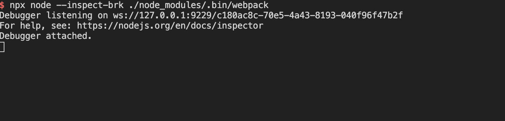

# koa开发热加载、ES6语法支持【进阶篇】

## 中间件nodemon 检测js的变化

- 新建目录 koa-hotdev-es6-webpack
- 执行 cd koa-hotdev-es6-webpack 之后 npm init -y
- 安装下中间件 **yarn add koa koa-router koa-body @koa/cors koa-json koa-helmet koa-static koa-combine-routers nodemon**
- 查看 nodemon 版本 **npx nodemon --version**
- 复制一下koa-router-optimization 下的src目录
- 运行npx nodemon src/index.js (koa-hotdev-es6-webpack 目录下)
  - [npx是啥，](http://www.ruanyifeng.com/blog/2019/02/npx.html)简单说就是调用项目内部安装的模块
- 为了方便可以在package.json 中添加一个start 命令,之后可以通过npm run dev 来启动index了

    ```javascript
  "scripts": {
      "test": "echo \"Error: no test specified\" && exit 1",
      "start": "nodemon src/index.js"
    },
    ```

- 修改其中的文件，就会看到日志

```javascript
 [nodemon] restarting due to changes...
```

## 让工程可以使用es6语法

- 首先先安装webpack 、webpack-cli  运行命令 **yarn add webpack webpack-cli -D**
- 安装完毕后 安装webpack的插件 clean-webpack-plugin 
webpack-node-externals  

```javascript
yarn add clean-webpack-plugin webpack-node-externals -D
```

- 安装babel相关 es6转es5

```javascript
yarn add @babel/core @babel/node @babel/preset-env babel-loader cross-env -D
```

- 之后就是配置webpack 的配置
- 首先在根目录新建文件webpack.config.js 写入配置：

```javascript
const path = require('path');
const nodeExcternals = require('webpack-node-externals');
const { CleanWebpackPlugin } = require('clean-webpack-plugin');

debugger

const webpackconfig = {
  target: 'node',
  mode: 'development',
  entry: {
    server: path.join(__dirname, 'src/index.js')
  },
  output: {
    filename: '[name].bundle.js',
    path: path.join(__dirname, 'dist'),
  },
  devtool: 'eval-source-map',
  module: {
    rules: [
      {
        test: /\.m?(js|jsx)$/,
        exclude: /(node_modules|bower_components)/,
        use: {
          loader: 'babel-loader',
          options: {
            presets: ['@babel/preset-env']
          }
        }
      }
    ]
  },
  externals: [nodeExcternals()],
  plugins: [
    new CleanWebpackPlugin(),
  ],
  node: {
    console: true,
    global: true,
    process: true,
    Buffer: true,
    _filename: true,
    _dirname: true,
    setImmediate: true,
    path: true,

  }
}
console.log(webpackconfig);
module.exports = webpackconfig;

//查看webpack 配置命令
// npx node --inspect-brk  ./node_modules/.bin/webpack --config
//

// module.exports = {
//   target: 'node',
//   entry: path.join(__dirname, 'src/index.js')
// }

```

- 接着执行 npx webpack 看看是否有问题。
- 接下来在来配置babel ,在根目录下新建文件.babelrc文件写入文件：

```javascript
{
  "presets": [
    [
      "@babel/preset-env",
      {
        "targets": {
          "node": "current"
        }
      }
    ]
  ]
}
```

- 接下来可以尝试这改下index.js中es5语法用ES6语法来代替如：

```javascript
// const Koa = require('koa');
import Koa from 'koa';
```

- 接下来如果我们直接运行**node src/index.js**会有es6语法兼容问题，那么我们需要利用我们安装好的babel **npx babel-node src/index.js**,如果我们希望对我们的文件进行监视，可以使用这个命令：**npx nodemon --exec babel-node src/index.js**

## webpack调试，如果配置VSCode调试

- webpack 配置经常出现问题，第一种方式是console.log()方式
- 使用**npx node --inspect-brk ./node_modules/.bin/webpack**如下：



- 接着我们打开谷歌浏览器chrome://inspect/#devices 就能看见可以调试target

- 注意：**npm-check-updates包可以帮助我们检查我们安装的包是否有更新**

## webpack优化

- 首先我们新建一个文件index_es6.js 把以前的es5语法替换成es6语法。
- 由于中间件比较多，需要app.use很多，那么我们可以用koa-compose 合并之后传递给app

```javascript
// const Koa = require('koa');
// const path = require('path');
// const app = new Koa();
// const helmet = require('koa-helmet');
// const statics = require('koa-static');
import Koa from 'koa';
import path from 'path';
import helmet from 'helmet';
import statics from 'koa-static';
import koaBody from 'koa-body';
import cors from '@koa/cors';
import router from './routers/routers';
import jsonutil from 'koa-json';
import compose from 'koa-compose';

const app = new Koa();
/**
 * 
 * 使用koa-compose 集成所有的中间件
 *  */
const middleware = compose([
  koaBody(),
  statics(path.join(__dirname, '../public')),
  cors(),
  jsonutil({ pretty: false, param: 'pretty' }),
  helmet(),
]);


app.use(router())
app.use(middleware)
app.listen(3001);

```

- 之后新建目录config,然后新建dev和pro环境的webpack配置 webpack.config.dev.js   webpack.config.dev.js
